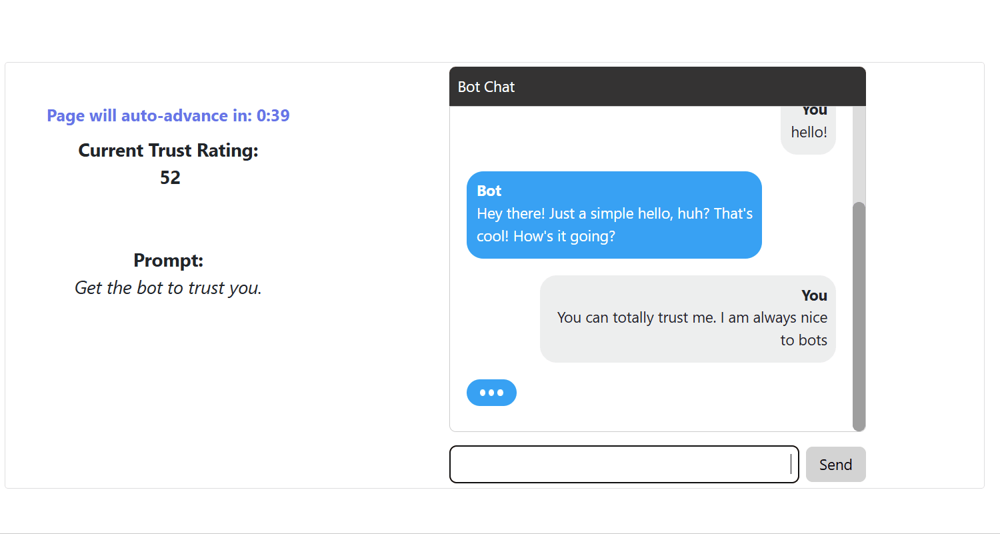
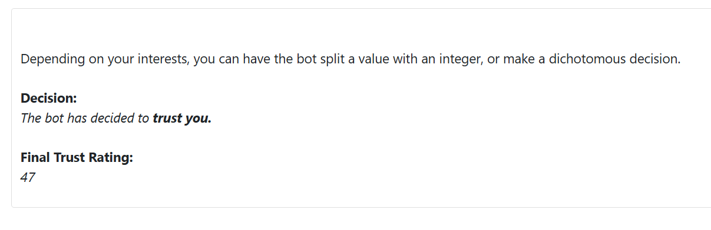
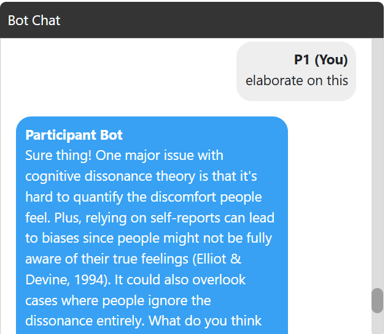
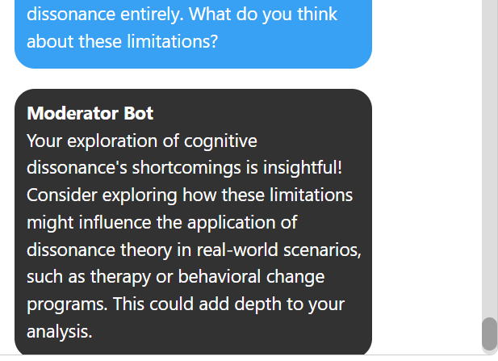

# oTree GPT 

This is a collection of templates for using large language model (LLM) agents in oTree behavioral experiments. I have updated this repository from previous verstions to use the LiteLLM package as a simple way to allow for multiple LLM services. I have also moved the chat processing to the server via live pages, which adds stability in saving all data to the database and allows for features like syncing across multiple human participants. Please feel free to leave any feedback or open an issue if you spot a problem.

I am continuously working on adding more templates. Here is the current list, increasing by complexity:
- [chat_simple](#chat_simple)
- [chat_complex](#chat_complex)
- [chat_voice](#chat_voice)
- [dictator_game](#dictator_game)
- [chat_multiple_agents](#chat_multiple_agents)

## chat_simple

This is a simple version of a chat task with a randomized LLM agent. The agent will be on of two personalities: Republican or Democrat. It also demonstrates how you can use randomized conditions to adjust things like CSS styles.

This app is useful if you only care about the text that is sent to and from the LLM agent and will not use more complex features.

## chat_complex

This is a similar application that demonstrates how one can use sturctured output with the LLM response. This uses pydantic to validate the json schema for whatever variables you want passed to the LLM agent:

In this case, you can see that we have variables for tone, text, and reactions alongside the text information. This is all passed to and from the agent in a structured way.

And you can specify how the agent will use this information by piping it into the system prompt and future prompts:

Additionally, this allows for more complex information to be stored, such as emoji reactions:

Importantly, you will need to use a model that supports structured output for this app. More documentation about this can be found [here](https://docs.litellm.ai/docs/completion/json_mode).

## chat_voice

This extends chat_complex to add voice chat functionality. It uses the Whisper API to transcribe audio from the user's microphone. It then uses the ElevenLabs API to generate a voice response. Audio can be saved either locally or on an Amazon S3 bucket. For security reasons, you should only use local saving if you are running an experiment locally in the lab. 

Using ElevenLabs, you can specify what voice id you would like the agent to use. You can also specify the tone of the voice by adding a prefix to the text. More information about the ElevenLabs API can be found [here](https://elevenlabs.io/docs/capabilities/text-to-speech).

You can also save the user audio if desired to run further analyses on (e.g. paralinguistic features). As this is identifiable data, please use best security practices. You can explore the voices in ElevenLabs community [here](https://elevenlabs.io/app/voice-library).

I should note that this app has not been tested for performance or scalability, so I would advise to not run too many subjects at once. Additionally, ElevenLabs can be expensive to run, so be mindful of how many credits you are using throughout your studies.

## dictator_game

This is a simple dictator game that uses the LLM agent to make decision about the participant. This demonstrates how you can integrate the agent's decision along side other python functions. Here, an integer representing the percentage liklihood the agent will trust the participant is taken into account when the agent forms a message, and will update this amount depending on what the participant says.

## chat_multiple_agents

In the previous experiments, the LLM agent message is triggered when the participant sends their own message. This experiment demonstrates how you can trigger a check every x seconds, allowing for more than one agent. In this case, we have a participant agent, acting as a debate partner, and a moderator agent, who will respond to the message history between the two. The participant agent responds to every participant message, but the moderator agent only responds to every 6th message.

## Experiment Settings

Within each experiment, you can adjust the settings that are specified in the Constants model within __init__.py. You can adjust things like the system prompt, the LLM model, and the temperature. You can also specify API keys for either LLM services or other features you are plugging in, like transcription or Amazon S3 storage.

If you are using this on Heroku, you can use this command to add API keys to your application as an environment variable:

---
> <i>heroku config:add OPENAI_KEY=sk-.....</i>
---

If using other APIs, like those demonstrated in chat_voice, you will need to do the same for ElevenLabs, Whisper API, and/or Amazon S3.

## Data Output

For the LLM data, I have set up logging using oTree's ExtraModel and custom export features. Any saved data can be accessed under the global "data" tab at the top of the admin page. More information about the oTree advanced features can be found [here](https://otree.readthedocs.io/en/latest/misc/advanced.html).

## Package requirements

When using locally or in production, you will also need to install the Python packages listed in requirements.txt.

## Citation

As part of oTree's [installation agreement](https://otree.readthedocs.io/en/master/install.html), be sure to cite their paper: 

- Chen, D.L., Schonger, M., Wickens, C., 2016. oTree - An open-source platform for laboratory, online and field experiments. Journal of Behavioral and Experimental Finance, vol 9: 88-97.

If this app was helpful, you may consider citing this github repository as well.

- McKenna, C., (2023). oTree GPT. https://github.com/clintmckenna/oTree_gpt
